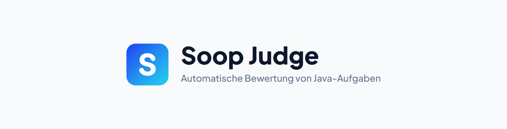
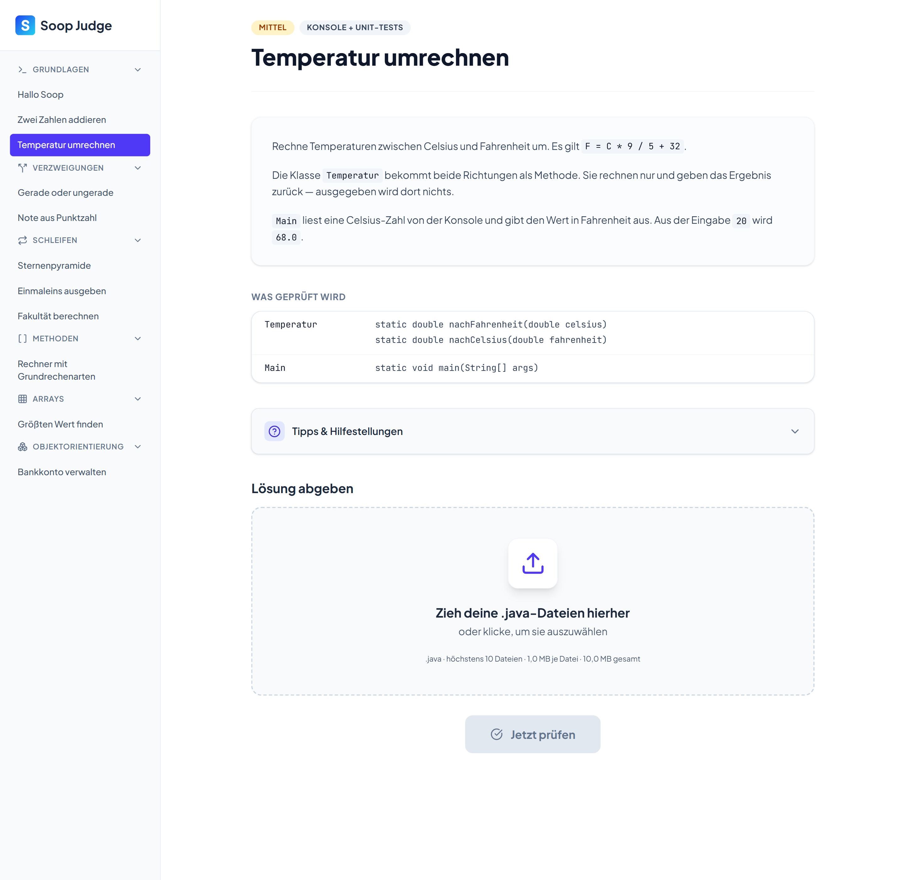
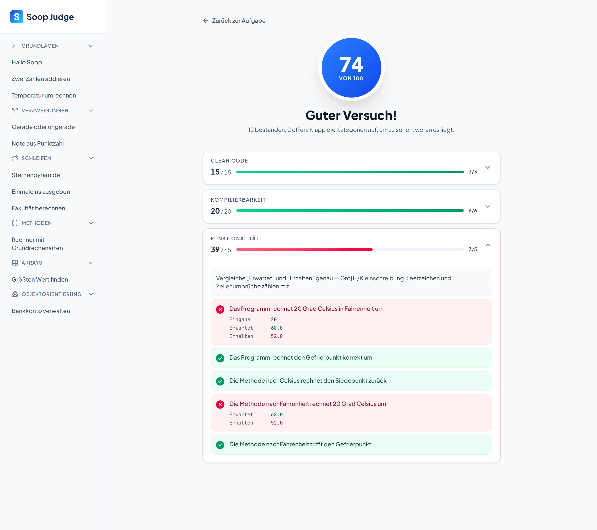
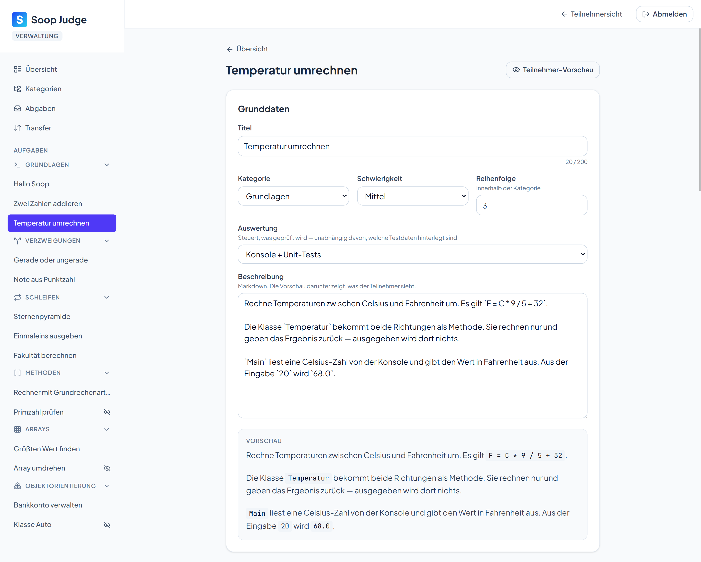

<p align="center">
  <picture>
    <source media="(prefers-color-scheme: dark)" srcset="docs/banner-dark.png">
    
  </picture>
</p>

Automatische Bewertung von Java-Programmieraufgaben. Teilnehmer laden ihre
`.java`-Dateien hoch, Soop Judge kompiliert sie, prüft sie gegen hinterlegte
Konsolen-Testfälle und JUnit-Tests und gibt ein kategorisiertes,
nachvollziehbares Feedback zurück. Aufgaben, Testfälle und Bewertungsgewichte
pflegt der Betreuer über ein Web-Panel, ohne Datenbankzugriff.

Gebaut für den SOOP-Workshop, Strukturierte Objektorientierte Programmierung.

**Stack:** ASP.NET Core (.NET 10) · React 19 + TypeScript + Tailwind 4 ·
PostgreSQL · JUnit 6 · Docker Compose

---

## Was es kann

**Für Teilnehmer**

- Aufgaben nach Kategorien, mit Beschreibung, Schwierigkeitsgrad und Tipps
- Der geforderte Vertrag ist sichtbar: welche Klassen und Methoden erwartet
  werden. Bewertet wird nur, was auch dasteht
- Mehrere `.java`-Dateien per Auswahl oder Drag & Drop; abgelehnte Dateien
  nennen immer den Grund
- Ergebnis nach Kategorien, mit *Eingabe*, *Erwartet* und *Erhalten* je
  Teilprüfung — Compilerausgaben und Stacktraces inklusive

**Für den Betreuer**

- Kategorien und Aufgaben anlegen, ändern, sortieren, sichtbar schalten
- Konsolen-Testfälle und JUnit-Dateien im Editor pflegen, aus Vorlagen oder
  per Datei-Upload
- Bewertungsgewichte je Aufgabe, mit Live-Vorschau der Normierung auf 100
- Vorschau der Teilnehmersicht und Probelauf: eine eigene Musterlösung durch
  die echte Auswertung schicken
- Abgaben-Übersicht mit Status, Punktzahl und abgegebenem Quelltext
- Den gesamten Aufgabenbestand als eine JSON-Datei aus- und einspielen

---

## Wie bewertet wird

Drei Kategorien: Clean Code, Kompilierbarkeit und Funktionalität. Jede trägt ein
Gewicht, und die Gewichte werden auf 100 Punkte normiert.

Gratispunkte gibt es dabei nicht. Hat eine Aufgabe für eine Kategorie gar keine
Prüfungen hinterlegt, fällt die Kategorie aus der Wertung und ihr Gewicht
verteilt sich auf die übrigen. Sonst bekäme eine Aufgabe ohne
Funktionalitätsprüfung deren Punkte geschenkt.

Innerhalb einer Kategorie zählt der Anteil der bestandenen Teilprüfungen.
Gerundet wird nach größtem Rest, damit die Summe exakt 100 ergibt, und
aufgerundet höchstens bis einen Punkt unter das Maximum: 65 von 65 darf nicht
neben einem roten Testfall stehen.

Die Gewichte lassen sich pro Aufgabe überschreiben.

**Umlaute im Namen kosten Punkte, und das ist Absicht.** Java hat mit `ä`, `ö`,
`ü` und `ß` kein Problem: in Bezeichnern, Kommentaren und Ausgaben sind sie
erlaubt, und technisch spricht nichts dagegen. Soop Judge wertet sie trotzdem
als Clean-Code-Verstoß, sobald sie in einem Namen stehen, den der Teilnehmer
selbst vergibt, weil die Teilnehmer in den Bewertungen ihres Studiums ebenfalls
Abzug dafür bekommen. Die Regel steht hier also nicht, weil Umlaute falsch
wären, sondern damit niemand sich eine Gewohnheit aneignet, die ihn später
Punkte kostet.

Gemeint sind Klassen, Methoden, Parameter, Variablen und Konstanten. In
Ausgabetexten, Zeichenketten und Kommentaren sind Umlaute erlaubt: eine Aufgabe
darf ihre Ausgabe wortgetreu vorschreiben, auch wenn dort „Größe" oder „Kühl"
steht, ohne dass die Musterlösung dafür einen Punkt verliert.

---

## Screenshots

<details>
<summary><b>Die Aufgabe</b> · Beschreibung, geforderter Vertrag, Tipps und Abgabe</summary>



</details>

<details>
<summary><b>Das Ergebnis</b> · je Teilprüfung „Eingabe", „Erwartet" und „Erhalten"</summary>



</details>

<details>
<summary><b>Die Verwaltung</b> · Aufgaben pflegen, mit Live-Vorschau der Teilnehmersicht</summary>



</details>

---

## Aufsetzen

Voraussetzung ist nur Docker mit Compose v2. .NET, Node und das JDK stecken in
den Images; auf dem Server ist nichts weiter zu installieren, auf den
Teilnehmerrechnern genügt ein Browser.

**1. Zugangsdaten setzen**

```bash
cp .env.example .env
```

Darin sind zwei Werte Pflicht: `POSTGRES_PASSWORD` für die Datenbank und
`Admin__Password` für `/admin` und alle `api/admin/*`. Fehlt das Admin-Passwort,
startet das Backend nicht. Ein klarer Abbruch ist besser als ein stiller Start
ohne Zugangsschutz. Alle übrigen Werte haben brauchbare Standardwerte.

**2. Starten**

```bash
docker compose -f docker-compose.yml up -d --build
```

Das `-f` ist keine Kosmetik: ohne die Angabe zieht Compose zusätzlich
`docker-compose.override.yml` mit und veröffentlicht damit den Datenbank-Port.
Diese Datei ist ausschließlich für die lokale Entwicklung gedacht.

Der erste Lauf baut beide Images und dauert einige Minuten. Danach müssen in
`docker compose ps` alle drei Dienste `healthy` melden. Das Tool ist dann unter
`http://<ip-des-servers>` erreichbar, die Verwaltung unter
`http://<ip-des-servers>/admin`.

```bash
docker compose logs -f backend
```

```bash
docker compose down
```

`down` stoppt alles, die Daten bleiben im Volume. Nur `down -v` löscht sie.

**Ports**

Nach außen ist genau ein Port offen. Ein nginx liefert die Seite aus und reicht
`/api` an das Backend weiter — Frontend und API haben damit denselben Ursprung.
Backend und Datenbank liegen in einem Docker-Netz ohne Route nach draußen.

| | Port | Erreichbar |
|---|---|---|
| Frontend + API (nginx) | `80`, über `HTTP_PORT` in der `.env` änderbar | aus dem Netz |
| Backend | `8080` | nur containerintern |
| PostgreSQL | `5432` | nur containerintern |

---

## Lokal entwickeln

Gebraucht werden das .NET 10 SDK, Node.js, Docker und ein JDK 21 im `PATH`
(`javac` und `java` werden je Abgabe als Prozess aufgerufen).

`.env` wie oben anlegen, die Frontend-Pakete einmalig installieren und die
Datenbank hochziehen:

```bash
npm --prefix src/SoopWorkshop.Frontend install
```

```bash
docker compose up -d db
```

Backend und Frontend laufen daneben direkt auf dem Rechner, am besten in zwei
Fenstern, damit die Protokolle lesbar bleiben:

```bash
dotnet run --project src/SoopWorkshop.Backend.API
```

```bash
npm --prefix src/SoopWorkshop.Frontend run dev
```

| | Adresse |
|---|---|
| Frontend | `http://localhost:5173` |
| Verwaltung | `http://localhost:5173/admin` |
| Backend API | `http://localhost:5120`, `https://localhost:7212` |
| API-Doku (Scalar, nur Development) | `http://localhost:5120/scalar` |
| PostgreSQL | `127.0.0.1:5432` |

Migrationen anwenden, ohne `--startup-project`, weil `AppDbContextFactory` den
Kontext zur Entwurfszeit selbst baut:

```bash
dotnet ef database update --project src/SoopWorkshop.Backend.Infrastructure
```

Nach jeder Änderung an Controllern oder DTOs die TypeScript-Typen neu erzeugen,
bei **laufendem** Backend:

```bash
npm --prefix src/SoopWorkshop.Frontend run api:types
```

Zwei Fallen kosten sonst Zeit. Das Backend hält seine DLLs, ein `dotnet build`
bei laufendem Backend scheitert deshalb mit `CS2012 … used by another process`;
erst stoppen, dann bauen. Und der Frontend-Port steht an zwei Stellen, in
`vite.config.ts` (`strictPort`) und im Backend unter `Cors:AllowedOrigins`. Wird
er nur an einer geändert, blockt der Browser jede Anfrage, und der Fehler sieht
nach einem kaputten Backend aus.

---

## Architektur

Clean Architecture im Backend, daneben ein eigenständiges React-Frontend.

```
SoopWorkshop.Shared                  DTOs, Enums, Konstanten
SoopWorkshop.Backend.Domain          Entities, kennt nur Shared
SoopWorkshop.Backend.Application     Services, Interfaces, Result<T>
SoopWorkshop.Backend.Infrastructure  EF Core, Repositories, Java-Checker,
                                     Warteschlange, Bestands-Transfer
SoopWorkshop.Backend.API             Controller, Middleware
SoopWorkshop.Frontend                React 19 + Vite + TypeScript + Tailwind 4
tests/SoopWorkshop.Tests             xUnit
```

Die Projekte tragen das Präfix `SoopWorkshop`: Soop Judge ist der Name des
Werkzeugs, SOOP-Workshop der Kurs, für den es gebaut wurde.

Für die Abhängigkeiten gelten feste Regeln. Domain kennt kein EF Core.
Application definiert die Interfaces, Infrastructure implementiert sie. Frontend
und Backend sprechen ausschließlich über HTTP; der Vertrag entsteht aus OpenAPI
und wird als TypeScript erzeugt.

So läuft eine Auswertung ab:

```
Upload → SubmissionService → Warteschlange (begrenzt)
       → EvaluationWorker (n parallel) → JavaAnalyzer
       → Checker (Vertrag, Kompilierbarkeit, Zeichensatz,
                  Namenskonventionen, Testfälle, JUnit)
       → EvaluationScorer → gespeichert → Frontend pollt den Status
```

Externe Prozesse (`javac`, `java`, JUnit) laufen ausschließlich über
`IProcessRunner`, nie direkt über `Process.Start`.

---

## Tests

```bash
dotnet test SoopWorkshop.slnx
```

```bash
npm --prefix src/SoopWorkshop.Frontend test
```

Rund 410 Projekt-Tests, davon gut 100 Integrationstests gegen ein echtes
PostgreSQL aus dem Container (Testcontainers), dazu rund 170 Frontend-Tests mit
Vitest.

**Die Projekt-Tests brauchen Docker.** Ohne Docker geht der schnelle Lauf:

```bash
dotnet test SoopWorkshop.slnx --filter "Category!=Integration"
```

---

## Gut zu wissen

Jede Abgabe wird kompiliert und ausgeführt. Der Backend-Container hat dafür
keine Route ins LAN und keine ins Internet, dazu Grenzen für Speicher, CPU und
Prozessanzahl sowie eine Zeitgrenze je Lauf. Eine eigene Isolation pro Abgabe
gibt es nicht: alle laufen im selben Container.

Es gibt genau ein Admin-Passwort und keine Benutzerverwaltung. Der Workshop hat
einen Betreuer, also gibt es keine Rollen, keine Konten und kein Zurücksetzen.

Ausgeliefert wird über http hinter nginx. Für HTTPS hängt ein Zertifikat an den
Reverse Proxy; das Backend wertet `X-Forwarded-Proto` bereits aus, im Code ist
dafür nichts zu ändern.

Eine Auswertung, die ein Neustart unterbricht, wird beim nächsten Start als
fehlgeschlagen markiert. Der Teilnehmer sieht einen Hinweis und kann die Abgabe
wiederholen.

---

## Lizenz

[MIT](LICENSE). Verwenden, ändern und weitergeben ist frei, auch kommerziell.

Unter `lib/` liegt zusätzlich `junit-platform-console-standalone` (JUnit 6)
unverändert im Repository, damit der Build ohne Netz auskommt und im Workshop
nichts nachgeladen werden muss. Es steht unter der Eclipse Public License 2.0
und bringt eigene Unterkomponenten mit — Herkunft, Lizenzen und Fundorte der
vollständigen Texte stehen in
[THIRD-PARTY-NOTICES.md](THIRD-PARTY-NOTICES.md).
